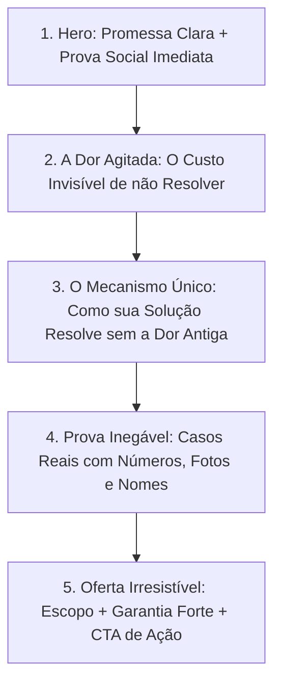

# Direct Response Copywriting — Copy de Alta Conversão

#categoria-cowork #copywriting #vendas #conversao #landing-page #persuasao

Esta skill governa o texto de vendas de landing pages, sites institucionais e páginas de produto. Ela elimina completamente a linguagem corporativa morta gerada por IAs padrão e a substitui por princípios de **Copywriting de Resposta Direta** (Eugene Schwartz, Dan Kennedy, Alex Hormozi).

---

## 1. O Filtro Anti-Clichê de IA (Expressões Terminantemente Banidas)

Se o texto gerado contiver qualquer uma das seguintes expressões, a copy é considerada um **fracasso absoluto**:
- [ERRO] *"Transformamos ideias em resultados extraordinários."*
- [ERRO] *"A excelência que sua empresa merece."*
- [ERRO] *"Soluções sob medida para o seu sucesso."*
- [ERRO] *"Em um mundo em constante evolução..."*
- [ERRO] *"Seja no ambiente X ou Y, estamos prontos para atender..."*
- [ERRO] *"Nossa missão é encantar nossos clientes."*

---

## 2. A Fórmula da Proposta de Valor no Hero (Dobra 1)

O H1 e o subtítulo devem seguir a **Fórmula da Oferta Irresistível**:

$$\text{Headline} = [\text{Resultado Específico Desejado}] + \text{sem} + [\text{Maior Dor / Esforço / Risco}] + \text{em} + [\text{Tempo Estimado}]$$

### Exemplos Reais de Mercado:
- **Para Escritório de Advocacia:**
  - [ERRO] *AI Padrão:* "Serviços jurídicos com tradição e compromisso."
  - [OK] *Resposta Direta:* "Recupere impostos pagos indevidamente nos últimos 5 anos sem entrar em litígios demorados."
- **Para Clínica Odontológica:**
  - [ERRO] *AI Padrão:* "O sorriso dos seus sonhos está aqui."
  - [OK] *Resposta Direta:* "Recupere a segurança de sorrir em público com implantes fixos instalados em apenas 3 sessões."
- **Para Barbearia / Salão:**
  - [ERRO] *AI Padrão:* "Estilo e elegância para o homem moderno."
  - [OK] *Resposta Direta:* "O corte que valoriza seu rosto sem você perder 2 horas esperando na fila — agende no seu horário exato."

---

## 3. Microcopy de Alta Conversão para Botões (CTAs)

Nunca use verbos neutros ou passivos. O botão deve completar a frase mental do usuário: *"Eu quero..."*.

| [ERRO] Verbo Fraco de IA | [OK] Microcopy de Resposta Direta | Gatilho Psicológico |
| :--- | :--- | :--- |
| **"Enviar"** | *"Quero Falar com um Especialista"* | Propósito claro de destino. |
| **"Saiba Mais"** | *"Ver Como Funciona na Prática"* | Redução de medo de complicação. |
| **"Agendar"** | *"Garantir Meu Horário sem Fila"* | Escassez e benefício imediato. |
| **"Cadastre-se"** | *"Começar Meu Teste Grátis de 14 Dias"* | Remoção de barreira financeira. |
| **"Comprar"** | *"Quero Ter Acesso Imediato"* | Gratificação instantânea. |

---

## 4. O Sistema de Desarmamento de Objeções (A Seção FAQ de Verdade)

A seção de FAQ não serve para responder perguntas triviais; ela serve para **assassinar as dúvidas que impedem o cartão de passar**:

1. **Objeção de Preço / "Está Caro":**
   - Responda comparando com o custo de continuar com o problema: *"Quanto custa para o seu negócio perder 5 clientes por semana por falta de agendamento online?"*
2. **Objeção de Tempo / "Não Tenho Tempo Agora":**
   - Mostre que o esforço é transferido para o prestador: *"Você só precisa de 15 minutos para nos enviar o briefing. Nós cuidamos de todo o resto."*
3. **Objeção de Risco / "E se não funcionar para mim?":**
   - Ofereça **Inversão de Risco Clara** (Garantia incondicional de 7 a 30 dias ou retrabalho gratuito até aprovação).

---

## 5. Arquitetura da Página em 5 Blocos Emocionais

