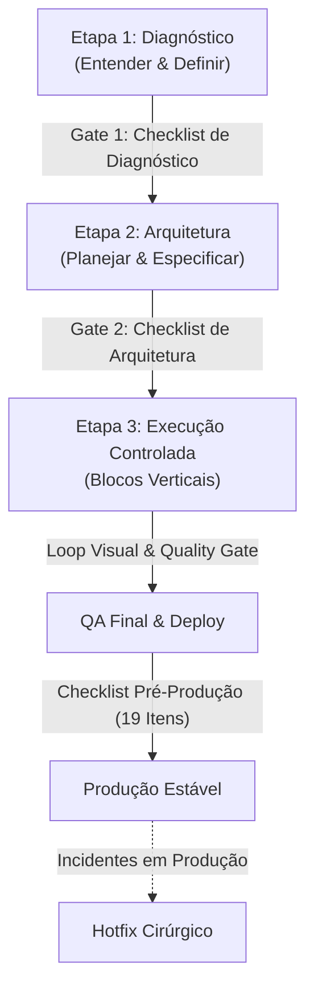

# Framework Universal de Criação e Governança de Projetos com IA

#categoria-code #arquitetura #planejamento #seguranca #hotfix #governanca #supabase #qualidade

> **REGRA CENTRAL INVIOLÁVEL:**
> **PRIMEIRO ENTENDER. DEPOIS PLANEJAR. SÓ ENTÃO EXECUTAR.**
> Se a IA começar a codar durante o diagnóstico, interrompa. Se estiver executando sem arquitetura e schema definidos, volte uma etapa. O ganho de velocidade vem da eliminação de retrabalho, não de pular planejamento.

---

## 1. A Stack Base Padrão

- **IA de Desenvolvimento:** Antigravity / Claude Code / ChatGPT.
- **Versionamento & Histórico:** GitHub (branches estruturadas, commits semânticos, PRs pequenos).
- **Hospedagem & Edge:** Vercel (ou equivalente moderno para Next.js / frontend).
- **Backend, Banco & Autenticação:** Supabase (PostgreSQL, Auth com RLS, Storage e Edge Functions).

> **Regra de Mudança de Stack:** Não trocar tecnologia por moda ou hábito da IA. Se a stack base atende, preserve-a. Qualquer alteração de stack exige justificativa técnica prévia antes da Etapa 2.

---

## 2. O Processo em 3 Etapas e Seus Hard-Gates



---

### ETAPA 1 — Diagnóstico e Definição do Projeto (Prompt 1)

**Objetivo:** Receber, auditar e organizar tudo sobre o cliente/produto antes de escrever uma única linha de código ou desenhar telas.

#### O que deve ser enviado:
- Identidade visual, logo, manual de marca, tipografia e cores existentes.
- Textos, fotos reais, documentos e referências visuais de mercado.
- Regras de negócio, catálogo de serviços/produtos, preços, garantias e restrições.
- Dores do cliente, persona-alvo e modelo de monetização.

#### Proibições Estritas da Etapa 1:
- [ERRO] **NÃO programar nada.**
- [ERRO] **NÃO desenhar layouts ou wireframes.**
- [ERRO] **NÃO gerar componentes ou Design Systems nesta etapa.**

#### Saída Obrigatória da Etapa 1:
1. Resumo executivo do projeto e proposta de valor clara.
2. Definição da persona e do público prioritário.
3. Tom de voz e posicionamento da marca.
4. Escopo claro: o que **está** incluído e o que **NÃO está** incluído.
5. Lista curta (máximo 3 a 5 perguntas) de decisões críticas pendentes que mudam a arquitetura.

#### Checklist Operacional de Saída — Gate 1:
- [ ] Problema a ser resolvido claramente definido.
- [ ] Objetivo de negócio mapeado e mensurável.
- [ ] Público-alvo e personas definidos.
- [ ] Oferta e proposta de valor compreendidas.
- [ ] Materiais do cliente inventariados e classificados.
- [ ] Fatos reais rigorosamente separados de suposições/hipóteses.
- [ ] Riscos técnicos e de negócio identificados.
- [ ] Lacunas realmente críticas respondidas (teto de 3 a 5 perguntas).
- [ ] Tipo de solução recomendado e fundamentado.
- [ ] **Aprovação formal do cliente/responsável concedida.**

> **Prompt de Ativação (Etapa 1):**
> *"Estamos iniciando um novo projeto e seguiremos obrigatoriamente o Framework Universal em 3 etapas. AGORA ESTAMOS EXCLUSIVAMENTE NA ETAPA 1 (DIAGNÓSTICO). Analise os materiais anexos, identifique regras de negócio, limites e premissas. NÃO desenhe, NÃO programe e NÃO avance para a Etapa 2 sem minha aprovação formal."*

---

### ETAPA 2 — Arquitetura, Planejamento e Especificação (Prompt 2)

**Objetivo:** Transformar o briefing aprovado em um sistema de decisões arquiteturais fechadas. Nada relevante deve ficar para "decidir na hora de codar".

#### Saída Obrigatória da Etapa 2:
1. **Mapa de Telas e Fluxos de Navegação:** Árvore de rotas, estados vazios (empty states), telas de erro e fluxos de usuário.
2. **Modelagem de Dados (PostgreSQL / Supabase):** Tabelas, colunas, tipos primitivos, chaves primárias e relacionamentos (FKs).
3. **Regras de Permissão & RLS (Row Level Security):** Políticas de leitura/escrita por usuário, perfil ou organização.
4. **Catálogo de APIs e Integrações:** Rotas, endpoints, RPCs, webhooks e provedores externos (ex: Stripe, WhatsApp).
5. **Direção de Arte e Design Tokens:** Tipografia confirmada, paleta de cores (hexadecimais testados contra contraste WCAG AA), radius e espaçamentos.
6. **Plano de Execução em Fatias:** Lista numerada de blocos de implementação sequenciais.
7. **Critérios de Aceite:** Regras objetivas para validar o fim da entrega.

#### Checklist Operacional de Saída — Gate 2:
- [ ] Mapa completo de páginas, telas e módulos.
- [ ] Fluxos principais e casos de exceção documentados.
- [ ] Regras de negócio explicitadas sem ambiguidade.
- [ ] Modelo relacional de banco e integridade referencial fechados.
- [ ] Papéis, permissões e matriz de acesso definidos.
- [ ] Integrações e webhooks mapeados.
- [ ] Segurança e políticas de RLS planejadas para cada tabela.
- [ ] Fluxos de UX e navegação fechados.
- [ ] Design System, paleta de cores e tokens validados.
- [ ] Responsividade deliberada planejada (desktop 1440px vs mobile 390px).
- [ ] Metas de acessibilidade e performance (Core Web Vitals) estabelecidas.
- [ ] Critérios objetivos de aceite especificados.
- [ ] Plano de execução estruturado em blocos verticais independentes.
- [ ] **Aprovação técnica formal concedida.**

> **Prompt de Ativação (Etapa 2):**
> *"A Etapa 1 foi aprovada. Avance para a ETAPA 2 (ARQUITETURA E PLANEJAMENTO). Especifique a estrutura de páginas, modelo de dados PostgreSQL, regras de RLS do Supabase, fluxos de API, regras de negócio e o plano de fatiamento da execução. NÃO inicie a codificação da Etapa 3 sem minha aprovação."*

---

### ETAPA 3 — Execução em Blocos Controlados (Prompt 3)

**Objetivo:** Construir o sistema em fatias verticais pequenas, testáveis e estáveis, sem gerar código monolítico difícil de depurar.

#### Ordem Recomendada de Construção:
1. **Fundação Técnica:** Repositório, dependências, rotas base e layout estrutural.
2. **Banco de Dados, Auth & Segurança:** Tabelas, migrations, Supabase Auth e RLS ativado.
3. **Módulos Centrais de Negócio:** CRUDs, lógica principal e fluxos transacionais.
4. **Integrações & Webhooks:** Serviços de terceiros, pagamentos, mensageria e automações.
5. **Interface Visual & Conteúdo:** Aplicação dos design tokens, tipografia e assets reais.
6. **Refinamento Responsivo:** Recomposição deliberada para viewports mobile (390px).
7. **QA, Loop Visual & Build:** Bateria de testes, validação de build limpo e deploy.

#### Regras Invioláveis de Execução:
- **Fatia Vertical Completa:** Cada bloco implementa Banco → API/Backend → Interface do recurso antes de passar ao próximo.
- **Sem Placeholders:** Proibido deixar funções vazias, `TODO: implementar depois` ou links `href="#"` sem destino planejado.
- **NUNCA Inventar Informações Reais:** É expressamente proibido inventar avaliações, métricas de faturamento, anos de experiência, nomes de clientes, preços ou depoimentos. Se o dado não existir nos insumos, solicite ou omita deliberadamente.
- **Validação Contínua:** Execute `build` e linters ao término de cada bloco. Só avance após confirmar que o bloco atual está 100% funcional.

> **Prompt de Ativação (Etapa 3):**
> *"A Etapa 2 foi aprovada. Avance para a ETAPA 3 (EXECUÇÃO CONTROLADA). Inicie exclusivamente pelo Bloco 1 do plano aprovado. Construa a fatia funcional completa, teste a compilação e reporte a entrega para validação antes de ir para o Bloco 2."*

---

## 3. Protocolos de Validação Visual e Qualidade de Produto

### O Loop Visual Obrigatório

Nenhuma skill ou instrução textual substitui a inspeção visual real do que foi renderizado. Após cada implementação de interface:

$$\text{IMPLEMENTAR} \longrightarrow \text{RENDERIZAR} \longrightarrow \text{VER (Screenshot)} \longrightarrow \text{CRITICAR} \longrightarrow \text{CORRIGIR} \longrightarrow \text{RE-VALIDAR}$$

1. **Captura Visual:** Renderizar a tela e inspecionar em viewport Desktop (1440px) e Mobile real (390px).
2. **Crivo Crítico:** A interface parece genérica? O hero tem impacto publicitário? Há espaçamento em excesso sem intenção?
3. **Correção Cirúrgica:** Ajustar tipografia, contrastes, ritmo visual e alinhamento antes de considerar a seção pronta.

---

### A Bateria de 8 Quality Gates de Produto

Submeta a interface a estes 8 testes impiedosos antes de aprovar para produção:

1. **Teste dos 5 Segundos:** Uma pessoa que nunca viu a empresa entende a proposta de valor, nicho e ação principal nos primeiros 5 segundos?
2. **Teste do Hero:** O viewport inicial é uma peça publicitária de alto nível ou apenas a fórmula batida de headline + parágrafo + botão + imagem lateral?
3. **Teste de Identidade:** Se trocarmos o logotipo pelo da concorrência direta, a página continua funcionando? Se sim, o design está genérico e requer direção de arte proprietária.
4. **Teste do Objeto-Herói:** O produto físico, software ou elemento central está integrado de forma memorável na cena ou jogado dentro de um card com bordas arredondadas e sombra padrão?
5. **Teste Tipográfico:** Existe hierarquia, ritmo e personalidade ou a página caiu no padrão cinza de Inter + slate-900 sem alma?
6. **Teste Mobile:** O mobile é uma recomposição inteligente da ideia ou apenas um empilhamento vertical cansativo do desktop?
7. **Teste Anti-Slop:** Foram eliminados padrões batidos como gradientes roxo/azul gratuitos, badges infladas, Lucide icons em círculos em todas as seções e cartões dentro de cartões (*card soup*)?
8. **Teste Comercial:** O produto comunica valor e resolve objeções reais antes de tentar exibir efeitos técnicos?

---

### Checklist Rigoroso Pré-Produção (19 Itens)

Execute este checklist antes de apontar qualquer domínio para produção:

- [ ] **Dados Reais Conectados:** Banco de dados de produção configurado e populado com dados válidos.
- [ ] **Remoção de Mocks:** Nenhum `localStorage`, array estático em memória ou mock temporário como fonte de verdade.
- [ ] **Auth & Sessão Testados:** Fluxos de cadastro, login, recuperação de senha, expiração de token e logout validados.
- [ ] **Auditoria de RLS Concluída:** 100% das tabelas com Row Level Security habilitado e políticas restritivas testadas via API.
- [ ] **Constraints Validadas:** Chaves estrangeiras, regras `NOT NULL`, `CHECK` e índices únicos ativos no banco.
- [ ] **Idempotência Transacional:** Operações críticas de pagamento, reservas ou disparos protegidas contra cliques duplos.
- [ ] **Integridade em Exclusões:** Proibido uso indiscriminado de `CASCADE` em dados fiscais ou relacionamentos críticos.
- [ ] **Tratamento de Exceções:** Telas de erro amigáveis (404, 500) e empty states claros sem vazar dados sensíveis no console.
- [ ] **Validação Mobile:** Testado minuciosamente em viewport móvel (390px) sem quebra de viewport ou overflow horizontal.
- [ ] **Validação Desktop:** Layout equilibrado e sem esticar desproporcionalmente em telas ultrawide ou 1440px+.
- [ ] **Acessibilidade Básica:** HTML semântico (`<main>`, `<nav>`, `<button>`), contraste WCAG AA e navegação por teclado funcional.
- [ ] **Performance Revisada:** Imagens comprimidas em WebP/AVIF, lazy loading ativo e métricas Core Web Vitals no verde.
- [ ] **Sanitização de Código:** Linters, verificações de TypeScript (`tsc`) sem suppressões (`@ts-ignore`) arbitrárias.
- [ ] **Build Local Verde:** Comando de compilação de produção (`npm run build` / `pnpm build`) executado com sucesso localmente.
- [ ] **Preview Validado:** Ambiente de staging/preview testado em fluxo end-to-end idêntico ao usuário final.
- [ ] **Segredos & Variáveis:** Variáveis de ambiente configuradas na hospedagem (Vercel) sem credenciais em repositório.
- [ ] **Backup Realizado:** Rotinas de backup ativas no banco de dados e plano de rollback preparado.
- [ ] **Publicação Concluída:** Deploy em produção realizado com propagação DNS e certificado SSL ativo.
- [ ] **QA Pós-Deploy:** Teste de fumaça (smoke test) efetuado diretamente na URL pública de produção.

---

## 4. Protocolos Especiais de Ciclo de Vida

### Prompt 4 — QA e Auditoria Pré-Deploy
Execute este protocolo antes de liberar para produção:
- [ ] **Fluxos Críticos:** Testar ponta a ponta cadastro, login, compra/agendamento e formulários de contato.
- [ ] **Console & Logs:** Zero erros ou avisos de hidratação no DevTools/Terminal.
- [ ] **Cross-Device:** Testar responsividade em viewport mobile (375px/390px), tablet (768px) e desktop (1440px).
- [ ] **Acessibilidade & Semântica:** Uso correto de tags (`<main>`, `<header>`, `<button>` em vez de `<div>` clicável), contraste WCAG AA.
- [ ] **Performance:** Imagens com lazy loading, formato WebP/AVIF e dimensões explícitas.

---

### Prompt 5 — Protocolo de Hotfix Controlado (Anti-Caos em Produção)

Quando um incidente ocorrer em ambiente de produção, este protocolo entra em vigor imediatamente para conter a tendência da IA de reescrever arquivos alheios ao bug.

#### O que fazer antes de tocar no código:
1. Isolar e reproduzir o erro com base em logs ou steps claros.
2. Mapear a causa raiz exata e o **menor escopo possível de correção**.

#### Proibições Terminantes em Hotfix:
- [ERRO] **PROIBIDO fazer redesign.**
- [ERRO] **PROIBIDO refatorar o projeto ou arquivos não relacionados.**
- [ERRO] **PROIBIDO alterar migrations ou schemas de banco sem extrema necessidade.**
- [ERRO] **PROIBIDO apagar dados ou bypassar regras de validação.**
- [ERRO] **PROIBIDO remover funcionalidade apenas para o build passar.**
- [ERRO] **PROIBIDO criar workarounds temporários sem documentação explícita.**

#### Entrega do Hotfix:
- Arquivos estritamente alterados (diff mínimo).
- Prova de teste do fluxo afetado.
- Confirmação de que o restante da aplicação não sofreu regressão.

---

## 5. Padrão Obrigatório de Segurança e LGPD (Supabase & Web)

Em qualquer aplicação com autenticação, banco ou dados de usuários:

1. **Row Level Security (RLS) Mandatório:**
   - Toda e qualquer tabela do Supabase **DEVE ter RLS ativado** (`ALTER TABLE x ENABLE ROW LEVEL SECURITY;`).
   - Crie políticas explícitas (`FOR SELECT`, `FOR INSERT`, `FOR UPDATE`, `FOR DELETE`) amarradas a `auth.uid() = user_id`.
   - **Regra de Ouro:** *Nunca aceite "o botão está escondido no frontend" como controle de permissão.* A segurança reside 100% no banco e nas APIs.
2. **Proteção de Credenciais:**
   - A chave `service_role` **NUNCA** pode ser importada ou exposta no código cliente/browser.
   - Utilize apenas a chave pública `anon` no frontend. Operações com privilégio administrativo devem rodar em Edge Functions ou Server Actions seguras.
3. **Funções RPC & PostgreSQL:**
   - Funções com `SECURITY DEFINER` devem conter obrigatoriamente:
     ```sql
     SET search_path = public;
     ```
     para prevenir ataques de escalação de privilégios via path injection.
4. **LGPD e Minimização de Dados:**
   - Colete estritamente os campos necessários para a operação do negócio.
   - Forneça rota/mecanismo para exclusão ou anonimização de dados a pedido do titular.
   - Armazene senhas com hash criptográfico (gerenciado nativamente pelo Supabase Auth).

---

## 6. Orquestração Saudável de Skills

Para evitar sobrecarga de contexto e conflito de orientações na IA:
- **Não empilhe 5 a 10 skills ao mesmo tempo.**
- **Fluxo Recomendado:**
  1. **Planejamento:** `project-lifecycle-framework` (Etapas 1 e 2).
  2. **Direção Visual:** Escolha **1** skill criativa principal conforme a vibe (ex: `design-taste-frontend` para landing pages ousadas, `motion-design-system` para orquestração de animações, ou `high-end-visual-design` para refinamento estético).
  3. **Execução:** Foco no código e nos blocos da Etapa 3.
  4. **Auditoria:** Ative a bateria de 8 Quality Gates e o checklist de 19 itens de pré-produção antes de publicar.

---

## 7. Critério de Encerramento (Definição de "Pronto")

Um projeto **NÃO** está pronto quando *"não tem erro na tela"*. Ele está pronto quando:
1. Resolve o problema de negócio definido na Etapa 1.
2. Preserva dados, transações e permissões RLS com segurança absoluta.
3. Funciona de forma adaptada e responsiva em desktop (1440px) e mobile (390px).
4. Passa pelo build local verde e pelos 8 Quality Gates sem ressalvas.
5. Pode ser mantido por qualquer desenvolvedor sem depender de improvisos ou código monolítico.
