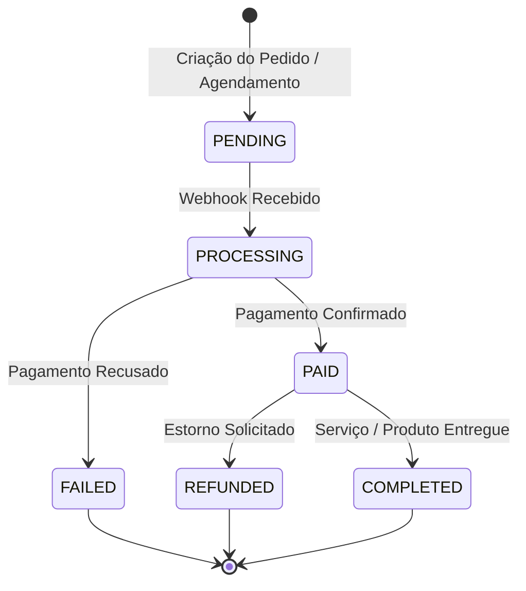

# SaaS Webhooks & Idempotency Engineering Skill

#categoria-code #webhooks #stripe #asaas #pagamentos #seguranca #idempotencia

Esta skill governa o recebimento e processamento de webhooks de pagamento (Stripe, Asaas, Mercado Pago) e mensageria (WhatsApp / Evolution API). Ela elimina as falhas fatais que causam prejuízo financeiro em produção: processar a mesma cobrança múltiplas vezes, quebrar a validação criptográfica HMAC por parsing indevido de JSON e sofrer timeouts por processamento síncrono.

---

## 1. A Regra do Raw Body (Verificação Criptográfica HMAC)

>  **REGRA DE OURO:** NUNCA faça `req.json()` ou parseie o corpo da requisição antes de validar a assinatura HMAC. Bibliotecas como Stripe ou Asaas exigem os bytes brutos exatos (`rawBody`) para calcular a chave de verificação.

### Padrão Next.js App Router (`app/api/webhooks/stripe/route.ts`):
```typescript
import { NextRequest, NextResponse } from 'next/server';
import Stripe from 'stripe';
import { processWebhookEvent } from '@/lib/payments/webhook-processor';

const stripe = new Stripe(process.env.STRIPE_SECRET_KEY!, { apiVersion: '2024-12-18.acacia' });
const webhookSecret = process.env.STRIPE_WEBHOOK_SECRET!;

export async function POST(req: NextRequest) {
  try {
    // 1. Obter o payload cru (raw string buffer)
    const rawBody = await req.text();
    const signature = req.headers.get('stripe-signature');

    if (!signature) {
      return NextResponse.json({ error: 'Assinatura ausente' }, { status: 400 });
    }

    // 2. Validação criptográfica com a chave secreta
    const event = stripe.webhooks.constructEvent(rawBody, signature, webhookSecret);

    // 3. Processamento idempotente desacoplado
    await processWebhookEvent(event);

    // 4. Retorno HTTP 200 imediato para o gateway
    return NextResponse.json({ received: true }, { status: 200 });
  } catch (err: any) {
    console.error('Falha na validação do webhook:', err.message);
    return NextResponse.json({ error: 'Webhook inválido' }, { status: 400 });
  }
}
```

---

## 2. A Tabela e o Padrão de Idempotência Atômica

Gateways de pagamento garantem entrega *at-least-once*, o que significa que eles **VÃO** reenviar o mesmo evento em caso de latência. 

Toda aplicação com cobrança deve possuir uma tabela de controle de eventos no PostgreSQL:

```sql
CREATE TABLE IF NOT EXISTS public.processed_webhooks (
  id uuid PRIMARY KEY DEFAULT gen_random_uuid(),
  gateway text NOT NULL,                -- 'stripe', 'asaas', 'mercadopago'
  event_id text NOT NULL,               -- ID único enviado pelo gateway (ex: 'evt_12345')
  event_type text NOT NULL,             -- 'checkout.session.completed'
  payload jsonb NOT NULL,
  status text NOT NULL DEFAULT 'processing', -- 'processing', 'completed', 'failed'
  created_at timestamptz DEFAULT now(),
  processed_at timestamptz,
  CONSTRAINT unique_gateway_event UNIQUE (gateway, event_id)
);

CREATE INDEX IF NOT EXISTS idx_webhook_lookup ON public.processed_webhooks (gateway, event_id);
```

### Função de Verificação e Reserva Atômica:
```typescript
import { createAdminClient } from '@/lib/supabase/admin';

export async function processWebhookEvent(event: Stripe.Event) {
  const supabase = createAdminClient();

  // Tenta registrar o evento de forma atômica
  const { data, error } = await supabase
    .from('processed_webhooks')
    .insert({
      gateway: 'stripe',
      event_id: event.id,
      event_type: event.type,
      payload: event.data.object,
      status: 'processing'
    })
    .select('id')
    .single();

  // Se der erro de violação de unicidade (código 23505), o evento já foi ou está sendo processado
  if (error && error.code === '23505') {
    console.log(`[Idempotência] Evento ${event.id} já registrado. Ignorando duplicata.`);
    return;
  }

  try {
    // Processamento da Máquina de Estados
    switch (event.type) {
      case 'checkout.session.completed':
        await handleCheckoutSuccess(event.data.object as Stripe.Checkout.Session);
        break;
      case 'customer.subscription.deleted':
        await handleSubscriptionCanceled(event.data.object as Stripe.Subscription);
        break;
      default:
        console.log(`Evento ${event.type} não mapeado.`);
    }

    // Marcar como concluído
    await supabase
      .from('processed_webhooks')
      .update({ status: 'completed', processed_at: new Date().toISOString() })
      .eq('event_id', event.id);

  } catch (err) {
    await supabase
      .from('processed_webhooks')
      .update({ status: 'failed' })
      .eq('event_id', event.id);
    throw err;
  }
}
```

---

## 3. Máquina de Estados de Transações

O status de pedidos e agendamentos deve obedecer a uma transição estrita de estados para evitar condições de corrida (Race Conditions):


