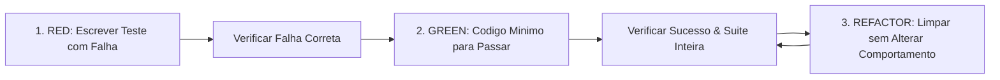

# Test-Driven Development (TDD Radical Sagital)

## Visao Geral

Escrever o teste primeiro. Observar a falha com os proprios olhos. Escrever o codigo minimo para faze-lo passar. Refatorar sob protecao da suite.

Se voce nao viu o teste falhar pelo motivo certo, voce nao provou que o teste e capaz de capturar a falha.

## A Lei de Ferro

```
NENHUM CODIGO DE PRODUCAO SEM TESTE VERMELHO PREVIO
```

Escreveu codigo de producao antes de criar o teste? O procedimento e categorico: apague o codigo e comece novamente a partir do teste.

Nao mantenha como "referencia", nao tente "adaptar" e nao preserve stubs. Apagar significa apagar fisicamente.

## O Ciclo Red-Green-Refactor



### 1. RED - Criar o Teste com Falha
- Escrever um teste conciso, unitario ou de integracao, especificando o comportamento desejado.
- Nome claro, foco em um unico comportamento, utilizando contratos e dados reais (evitar mocks a menos que a fronteira externa exija).
- EXECUTAR O TESTE E VERIFICAR A FALHA:
  - O teste deve falhar categoricamente (exit code != 0).
  - A mensagem de falha deve ser exatamente a ausencia da funcionalidade esperada, nao um erro de sintaxe, importacao ausente ou typo bobo.
  - Se o teste passar imediatamente: o teste e invalido ou a funcionalidade ja existe. Ajuste o teste.

### 2. GREEN - Implementacao Minima
- Escrever estritamente o codigo necessario para fazer o teste passar.
- Sem superengenharia prematura, sem implementacoes especulativas para requisitos futuros ("YAGNI").
- EXECUTAR O TESTE E A SUITE:
  - Confirmar que o novo teste passa (exit code 0).
  - Executar a suite completa do projeto para garantir zero regressao em modulos adjacentes.

### 3. REFACTOR - Otimizacao sob Protecao
- Limpar duplicidades, aprimorar nomes de variaveis, modularizar helpers internos.
- Executar os testes novamente: tudo deve permanecer verde.
- Proibido introduzir novas regras de negocio durante a fase de refatoracao.

## Checklist de Encerramento TDD

Antes de declarar o modulo ou funcionalidade como concluido:
- [ ] Todo metodo ou funcao publica possui teste correspondente.
- [ ] O teste falhou comprovadamente antes da implementacao existir.
- [ ] O codigo de producao e o minimo necessario para satisfazer a suite.
- [ ] A suite de testes global do repositorio rodou e esta 100% verde.
- [ ] Nenhum mock mascara a logica central do componente.
