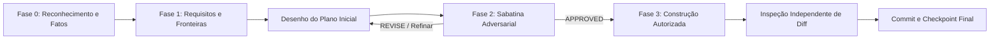

# Procedimento: Revisão Adversarial de Planos e Hardening Cognitivo (Doutrina Claudex)

> Protocolo canônico de endurecimento de planos e inspeção cruzada independente, assimilado da doutrina Claudex para o ecossistema ThSyr e Antigravity.

## 1. Princípio Fundamental
O agente que desenha a arquitetura de um plano **nunca deve ser o único a aprovar e atestar a sua robustez**. A validação exige tensão dialética e revisão hostil por um comitê cético independente antes de qualquer autorização de implementação em código.

## 2. As Quatro Fases do Ciclo de Hardening

### Fase 0 — Reconhecimento e Ledger de Premissas (Recon)
- Mapeamento explícito do código existente, callers, dependências e writers de estado compartilhado.
- Proibição de premissas implícitas: cada suposição deve ser acompanhada de arquivo e linha como evidência concreta.

### Fase 1 — Requisitos e Critérios Observáveis de Aceite
- Isolar de 3 a 5 decisões materiais que alteram o resultado final.
- Todo passo deve ter um critério de verificação observável (ex: comando de teste com saída esperada, código HTTP exato, ou query SQL).

### Fase 2 — Sabatina Adversarial (The Grilling / Plan Hardening)
O plano é submetido ao crivo do comitê de 3 papéis adversários independentes:
1. **Engenheiro Sênior Cético**:
   - Há sobre-engenharia?
   - O plano pode ser resolvido com 50% menos código?
   - Existem acoplamentos desnecessários?
2. **Auditor de Segurança e Permissões**:
   - Há risco de vazamento de tenant (RLS)?
   - Há comandos destrutivos sem reversibilidade mapeada?
   - Os dados sensíveis estão protegidos?
3. **Engenheiro de Confiabilidade e Resiliência (SRE)**:
   - O que acontece se a rede falhar na etapa intermediária?
   - Existe estratégia de rollback (*graceful degradation*)?

**Vereditos Possíveis**:
- `APPROVED`: O plano suportou o estresse sem pontos cegos críticos.
- `REVISE`: Falhas apontadas com evidências concretas; retorno obrigatório à fase de planejamento.
- `BLOCKED`: Violação de restrições reais inegociáveis (limites estruturais, regras fundacionais, entidades) ou risco destrutivo inaceitável.

### Fase 3 — Construção e Inspeção Cruzada Independente (Build & Cross-Inspection)
- Uma vez aprovado, a implementação é executada.
- **Inspeção de Diff**: Antes do commit final, uma sessão limpa ou subagente independente analisa o `git diff` exclusivamente contra os critérios de aceite definidos na Fase 1.
- Identifica regressões acidentais, código morto ou arquivos deixados para trás.

## 3. Integração com o ThSyr
- No Antigravity: Disparado proativamente pelo ThSyr ou via slash command `/grill-me` e subagentes com perfil de auditor.
- Na Engine ThSyr: Implementado pelo `PrefrontalPlanGate.adversarial_review()` e validado em tempo de execução pelo `ExecutiveVerifier`.

## Sinapses
- Conectado a [[Lobo_Frontal]].
- Conectado a [[Padroes_Engenharia]].
- Conectado a [[ThSyr]].
