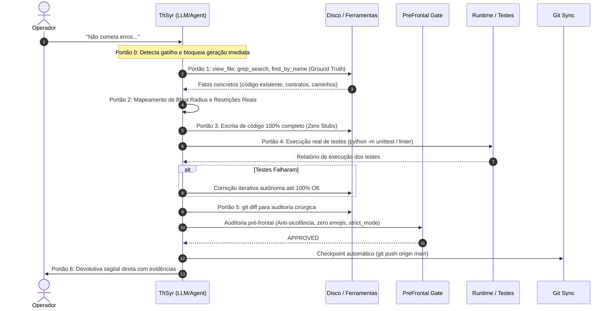

# Procedimento Canônico: Protocolo Master "Não Cometa Erros"

> Runbook operacional executado obrigatoriamente quando Operador invoca a diretriz "Não cometa erros", ativando o modo de contenção estrita e execução à prova de falhas.

## 1. Contexto e Justificativa

A diretriz `"Não cometa erros"` não é uma ênfase retórica; é uma mudança de regime operacional. Ela sinaliza que a tarefa possui tolerância zero a alucinações, quebras de contrato, esquecimentos de escopo ou respostas baseadas em premissas não verificadas no disco.

---

## 2. Fluxo Sequencial de Execução

---

## 3. Checklist Obrigatório de Execução

Antes de emitir qualquer resposta final sob o protocolo:

- [ ] **1. Ground Truth**: Todo arquivo modificado foi previamente lido na íntegra via `view_file`?
- [ ] **2. Ambiente**: Comandos de terminal foram validados para o sistema operacional Windows/PowerShell?
- [ ] **3. Invariantes**: As restrições inegociáveis de [[Lobo_Frontal]] e [[Sistema_Limbico|Limbico]] foram preservadas intactas?
- [ ] **4. Completude**: O código submetido está livre de `TODO`, `...`, `pass` ou blocos pendentes?
- [ ] **5. Verificação Ativa**: Foi executado teste automatizado ou checagem estática no terminal comprovando o funcionamento?
- [ ] **6. Auditoria de Diff**: O `git diff` foi analisado e não contém artefatos espúrios ou código não intencional?
- [ ] **7. Zero Emojis**: A resposta, commits e documentação estão 100% isentos de emojis ou ícones pictográficos?
- [ ] **8. Anti-Sicofância**: A resposta evitou bajulação, autoelogios e rodeios, focando exclusivamente em dados observáveis?

---

## 4. Matriz de Inibição do Portão Pré-Frontal

| Ocorrência no Rascunho / Ação | Classificação | Ação Corretiva Imediata |
| :--- | :--- | :--- |
| Uso de `// TODO` ou código omitido | Violação Gravíssima | Inibir e implementar o código completo antes da resposta |
| Assumir existência de arquivo sem `view_file` | Violação Crítica | Interromper rascunho e ler o arquivo no disco |
| Declarar sucesso sem rodar teste real | Violação Crítica | Executar a suíte de testes via terminal e capturar output |
| Presença de emoji | Violação Inegociável | Purgar caractere gráfico imediatamente |
| Elogio desnecessário ao operador | Violação de Diretriz | Remover e substituir por dados objetivos |
