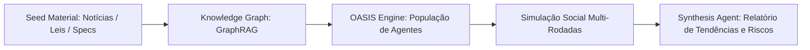

# MiroFish (Simulação Multi-Agente e Inteligência de Enxame)

Framework open-source de simulação social e predição por inteligência de enxame criado por **Guo Hangjiang** (*BaiFu* / `666ghj`), destaque global no GitHub Trending em março de 2026 e investido pelo Shanda Group.

## Sinapses
- Conectado a [[Lobo_Parietal]], [[Adversarial_Plan_Review]], [[Hybrid_Retrieval]] e [[Cortex_Central]].
- Referência avançada de arquitetura para a evolução do [[Executive_System]] e testes de estresse de mercado para produtos digitais.

## Princípio Fundamental: Grounded Emergence
Ao contrário de modelos preditivos que extrapolam regressões estatísticas do passado, o MiroFish constrói **mundos digitais paralelos** onde centenas de agentes de IA interagem sob regras, incentivos e memórias próprias. O futuro não é adivinhado: ele **emerge** do comportamento coletivo do enxame.

## Arquitetura Técnica
1. **Material Semente (Seed Input)**: Ingestão de documentos não estruturados (notícias, rascunhos de leis, propostas de precificação, lançamentos de produtos).
2. **GraphRAG (Estruturação de Atores)**: Extração de atores, motivações, laços de dependência e regras de governança em um grafo de conhecimento antes de iniciar qualquer simulação.
3. **Motor OASIS (CAMEL-AI)**: Instanciação de milhares de agentes com personas calibradas a partir do grafo, operando sob uma rede social simulada.
4. **Memória de Longo Prazo**: Utilização de camadas como Zep Cloud para manter a consistência biográfica e histórica de cada agente durante as rodadas de interação.
5. **Síntese de Emergência**: Um agente observador consolida o comportamento de manada, pontos de ruptura, polarização e reações em cadeia em um relatório preditivo executivo.

## Aplicações Estratégicas
- **Sabatina Mercadológica em Enxame**: Extensão da doutrina de [[Adversarial_Plan_Review]], submetendo mudanças de produto (ex: precificação de planos SaaS) a um enxame de consumidores virtuais.
- **Referência Científica**: Modelo conceitual para estudos de GraphRAG, compressão de contexto e dinâmicas multi-agente.
